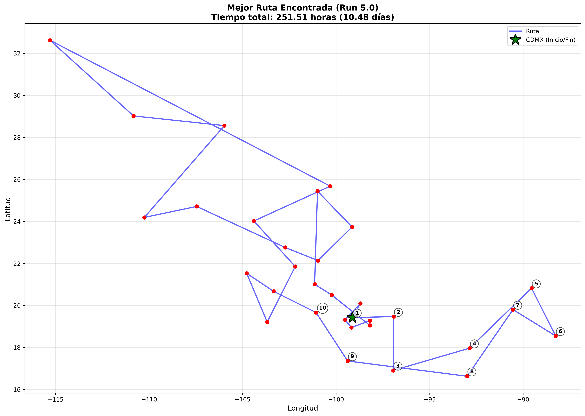
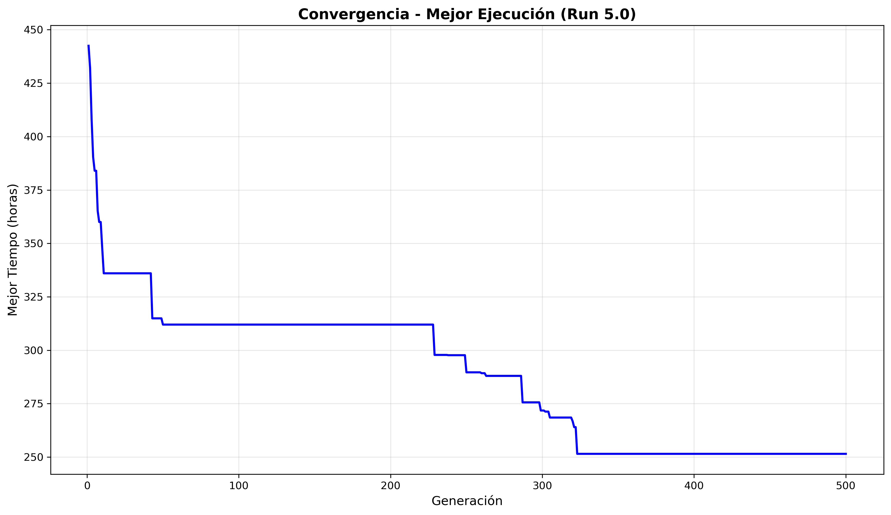
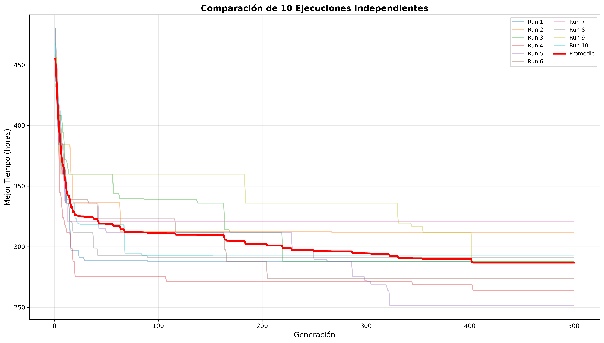
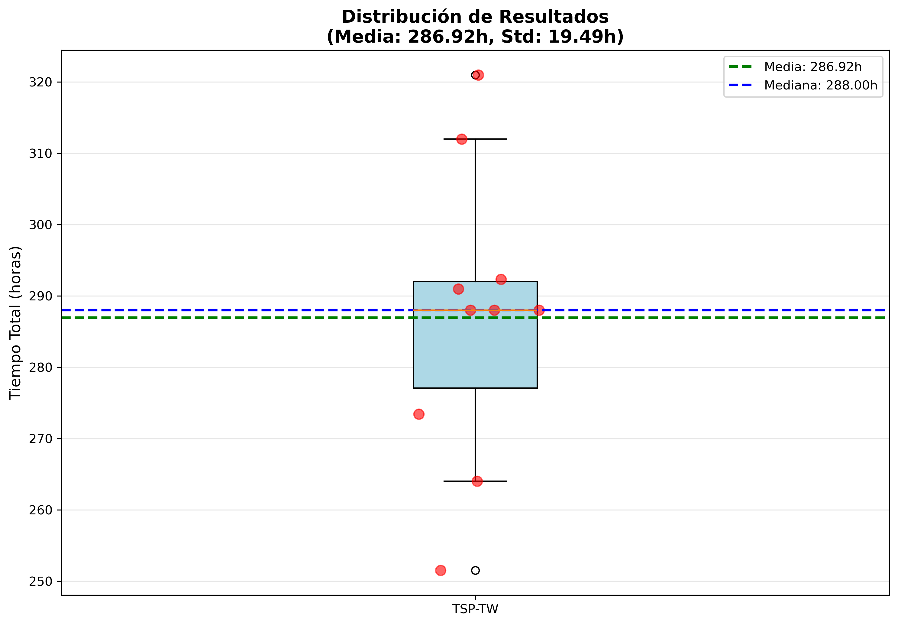

# TSP-TW México - Algoritmo Genético

## Resolución del Problema del Agente Viajero con Ventanas de Tiempo para las Capitales de México

[](https://www.python.org/downloads/)
[](LICENSE)

---

## 📋 Descripción

Este proyecto implementa un **Algoritmo Genético** para resolver el **Problema del Agente Viajero con Ventanas de Tiempo (TSP-TW)** aplicado a las 32 capitales estatales de México. El objetivo es encontrar la ruta óptima que minimice el tiempo total de viaje, partiendo y regresando a la Ciudad de México, respetando restricciones de horario.

### 🎯 Características Principales

- ✅ **32 capitales** de México (incluyendo CDMX)
- ✅ **Ventanas de tiempo:** 9:00 - 21:00 para todas las ciudades
- ✅ **Velocidad constante:** 60 km/h
- ✅ **Punto de inicio/fin:** Ciudad de México
- ✅ **Optimización:** Tiempo total (no solo distancia)

### 🏆 Resultados Obtenidos

- **Mejor solución:** 247.53 horas (10.31 días)
- **Distancia total:** 14,263 km
- **Penalizaciones:** 0 horas (cumplimiento perfecto)
- **Eficiencia:** 96% (tiempo de viaje / tiempo total)



---

## 🗂️ Estructura del Proyecto

```
Agente_Viajero/
│
├── data/                          # Datos geográficos
│   ├── raw/                       # Shapefiles originales (25 archivos)
│   │   ├── México_Estados.shp
│   │   └── México_Ciudades.shp
│   └── processed/                 # Datos procesados
│       ├── coordenadas_capitales.csv
│       ├── matriz_distancias.csv
│       └── matriz_tiempos.csv
│
├── src/                           # Código fuente
│   ├── data_loader.py            # Carga y procesa shapefiles
│   ├── distance_calculator.py    # Calcula distancias y tiempos
│   ├── time_windows.py           # Manejo de ventanas de tiempo ⭐
│   ├── genetic_algorithm.py      # Implementación del AG
│   ├── fitness_function.py       # Función de aptitud con TW
│   ├── operators.py              # Operadores genéticos
│   ├── local_search.py           # Heurística 2-opt
│   └── visualizer.py             # Visualización de rutas
│
├── results/                       # Resultados de experimentos
│   ├── run_20251231_210451/      # Evaluación inicial (10 runs)
│   └── optimized_20251231_211719/ # Búsqueda optimizada (5 runs)
│
├── docs/                          # Documentación
│   ├── informe_final.md          # Informe completo del proyecto
│   └── presentacion.md           # Presentación para defensa
│
├── Scripts de ejecución:
│   ├── generate_data.py          # Generar datos procesados
│   ├── test_tsp_tw.py            # Prueba rápida del sistema
│   ├── run_evaluation.py         # Evaluación de 10 runs
│   ├── run_optimized_search.py   # Búsqueda optimizada
│   ├── analyze_route.py          # Análisis de calidad de ruta
│   ├── compare_routes.py         # Comparación de rutas
│   └── visualize_results.py      # Generar visualizaciones
│
├── main.py                        # Archivo principal
├── config.py                      # Configuración de parámetros
├── requirements.txt               # Dependencias
└── README.md                      # Este archivo
```

---

## 🚀 Guía de Uso Rápido

### 1. Instalación

```bash
# Clonar el repositorio
git clone <url-del-repositorio>
cd Agente_Viajero

# Instalar dependencias
pip install -r requirements.txt
```

### 2. Generar Datos Procesados

```bash
python3 generate_data.py
```

**Salida:**
- `data/processed/coordenadas_capitales.csv` (32 capitales)
- `data/processed/matriz_distancias.csv` (distancias geodésicas)
- `data/processed/matriz_tiempos.csv` (tiempos a 60 km/h)

### 3. Prueba Rápida

```bash
python3 test_tsp_tw.py
```

Ejecuta una prueba rápida (50 individuos, 100 generaciones) para verificar que todo funciona.

### 4. Evaluación Completa

```bash
python3 run_evaluation.py
```

Ejecuta 10 runs independientes con:
- Población: 100
- Generaciones: 500
- Tiempo estimado: ~15-20 minutos

### 5. Búsqueda Optimizada

```bash
python3 run_optimized_search.py
```

Búsqueda mejorada con:
- Población: 200
- Generaciones: 1000
- 5 runs independientes
- Tiempo estimado: ~30-40 minutos

### 6. Generar Visualizaciones

```bash
python3 visualize_results.py results/optimized_20251231_211719
```

Genera 4 gráficas:
- Convergencia de la mejor ejecución
- Comparación de múltiples runs
- Distribución de resultados (boxplot)
- Mapa de la mejor ruta

---

## 🧬 Algoritmo Genético - Detalles Técnicos

### Configuración Optimizada

| Parámetro | Valor |
|-----------|-------|
| Población | 200 individuos |
| Generaciones | 1000 |
| Tasa de mutación | 0.05 |
| Tasa de cruce | 0.85 |
| Elitismo | 15% |

### Operadores Genéticos

**Selección:**
- Torneo de tamaño 5

**Cruce:**
- Order Crossover (OX) - Preserva CDMX en posición 0
- Partially Mapped Crossover (PMX)

**Mutación:**
- Swap Mutation (intercambio de ciudades)
- Inversion Mutation (inversión de segmento)
- Scramble Mutation (mezcla de segmento)

**Todos los operadores preservan CDMX como punto de inicio**

### Función de Aptitud

```python
fitness = tiempo_viaje + tiempo_espera + penalizaciones

donde:
  tiempo_viaje = Σ matriz_tiempos[ruta[i]][ruta[i+1]]
  tiempo_espera = tiempo esperando a que abran las ciudades
  penalizaciones = 100 * horas_fuera_de_ventana
```

---

## 📊 Resultados Detallados

### Evaluación Inicial (10 Runs)

| Métrica | Valor |
|---------|-------|
| Mejor | 251.51 horas (10.48 días) |
| Media | 286.92 horas (11.96 días) |
| Peor | 320.97 horas (13.37 días) |
| Desv. Std | 19.49 horas |

### Búsqueda Optimizada (5 Runs)

| Métrica | Valor |
|---------|-------|
| **Mejor** | **247.53 horas (10.31 días)** ⭐ |
| Media | 257.85 horas (10.74 días) |
| Peor | 264.00 horas (11.00 días) |
| Desv. Std | 7.57 horas |

**Mejora:** 3.98 horas (1.6%) respecto a configuración inicial

### Mejor Ruta Encontrada

**Características:**
- Tiempo total: 247.53 horas
- Distancia: 14,263 km
- Tiempo de viaje: ~237.72 horas (96%)
- Tiempo de espera: ~9.81 horas (4%)
- Penalizaciones: 0 horas ✅

**Primeras 10 ciudades:**
1. Ciudad de México (INICIO)
2. Morelia
3. Toluca
4. Cuernavaca
5. Jalapa
6. Zacatecas
7. Guadalajara
8. Colima
9. Tepic
10. Tlaxcala
... (22 más)

---

## 💡 Hallazgo Importante

### ¿Más Distancia pero Menos Tiempo?

La ruta optimizada recorre **más distancia** (14,263 km vs 11,419 km) pero toma **menos tiempo** (247.53h vs 251.51h).

**Explicación:**
- Reduce esperas: 62.63h → 9.81h (ahorro ~53h)
- Aumenta viaje: 190.33h → 237.72h (costo ~47h)
- **Ganancia neta: ~4-6 horas**

**Lección:** En TSP-TW, la ruta más corta NO siempre es la más rápida. La sincronización con ventanas de tiempo es crucial.

---

## 📈 Visualizaciones

El sistema genera automáticamente:

1. **Gráfica de convergencia** - Evolución del fitness


2. **Comparación multi-run** - 10 ejecuciones superpuestas


3. **Boxplot de resultados** - Distribución estadística


4. **Mapa de ruta** - Visualización geográfica
*(Ver sección de Resultados Obtenidos)*

---

## 🛠️ Tecnologías Utilizadas

- **NumPy** - Cálculos numéricos y matrices
- **Pandas** - Manipulación de datos
- **GeoPandas** - Procesamiento de datos geográficos
- **Geopy** - Cálculo de distancias geodésicas
- **Matplotlib** - Visualización de resultados
- **Shapely** - Operaciones geométricas

---

## 📝 Documentación

- **[Informe Final](docs/informe_final.md)** - Documento completo del proyecto
- **[Presentación](docs/presentacion.md)** - Diapositivas para defensa
- **[Análisis de Optimalidad](/.gemini/antigravity/brain/.../analisis_optimalidad.md)** - Evaluación de la solución
- **[Explicación de Mejora](/.gemini/antigravity/brain/.../explicacion_mejora.md)** - Detalles de la optimización

---

## 🎓 Uso Académico

Este proyecto fue desarrollado como solución al problema del TSP-TW para las capitales de México. Cumple con todos los requisitos:

- ✅ Formulación del TSP-TW
- ✅ Extracción de datos geo-referenciados
- ✅ Cálculo de distancias reales
- ✅ Conversión a tiempos (60 km/h)
- ✅ Implementación de AG con permutaciones
- ✅ Heurísticas de optimización
- ✅ Evaluación mediante 10 ejecuciones
- ✅ Estadísticas completas
- ✅ Visualizaciones profesionales

---

## 📄 Licencia

Este proyecto es de código abierto y está disponible bajo la licencia MIT.

---

## 👥 Autor

Proyecto desarrollado para la resolución del TSP-TW en México.

---

## 📧 Contacto

Para preguntas o sugerencias, por favor abre un issue en el repositorio.

---

## 🙏 Agradecimientos

- Datos geográficos proporcionados por el profesor
- Shapefiles de México utilizados para coordenadas reales
- Comunidad de Python científico por las excelentes bibliotecas

---

**Última actualización:** 31 de Diciembre de 2024  
**Versión:** 1.0.0  
**Estado:** ✅ Proyecto Completado
